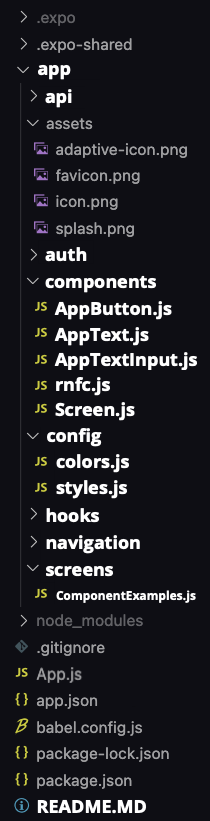
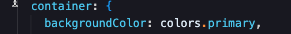
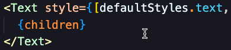

# React Native Template Repo - Eric Lantz

This is a template repo that contains a default React Native project using Expo **with additional useful elements.**

## **Table of Contents:**

1. [Installing Dependencies/Libraries](#installing)
2. [File Structure](#structure)
3. [Components](#components)
4. [React Native Functional Component Snippet](#rnfc)
5. [Config Files](#config)
6. [Comments](#comments)
7. [Contact Me](#final)

---

## Installing Dependencies/Libraries

To get all the dependencies and libraries that I installed for this template, enter `npm install` in the terminal when you open the application for the first time in your IDE.

**Added Dependencies:**

- @expo/vector-icons - for the `MaterialCommunityIcons` used in the app.
- expo-constants - for the _Screen.js_ component to keep all views on all devices the same.

Once you have created your own repo from the template, installed the dependencies, and are in your IDE, you can **Run** the app by typing the following in the terminal:

`expo start`

---

## **Template Features**

## File Structure:

_Everything in bold is added past the original `create-expo` file structure._

## Components

Added 4 components with general formatting that allow for starting the UI of the app more easily!

The **`screens`** folder contains a file called _ComponentExamples.js_ which is the screen that will be displayed when you start the application (done by typing `expo start` into the terminal).

In _ComponentExamples.js_, there are visual usages of all 4 of the additional components I created so it is easier to identify what they do and how they do it. The components in this file are calls of the components that are setup in the **`components`** folder in the file structure.

## React Native Functional Component Snippet

I also created an additional component in the components folder called rnfc (React Native Functional Component) that contains the structure to create a component script. You can copy the contents of this file and create a new snippet using it and it will contain all the structural elements needed for a component.

> The only thing needed to be changed when copying the code is you should have the component's function name match the name of the component you put in the file tree.
> 

_I was going to use a code snippet that could be downloaded, but not everyone uses Visual Studio Code and I figured this would be easier than having to learn how to import code snippets if you ddidn't know how anyway!_

## Config Folder

Created a config folder that contains a _colors.js_ file and a _styles.js_ file.

- The _colors.js_ file contains the setup for using a color theme in your application. It has spots for 3 main colors as well as black, white, light grey, medium grey, and dark grey. The great thing is though that it is completely customizable. It is just the setup of such a configuration so that you can change it to however many colors you want with any names you want. When you want to use those colors, simply import the colors script into your component and use dot notation to represent the color you want to use there.

  An example can be found in the _AppButton.js_ component in the styles section, but here it is as well in a more basic display:

  

* The styles.js file contains the setup for global styles that you would like to use throughout the repo. Any element that you want to have the styles from the config file can be done by just importing the default object from the styles.js file into your desired component:

  An example can be found in the _AppText.js_ component to give styling to the `Text` element. This is taking the styling element called 'text' that is found inside the config/styles.js folder:

  

  > `defaultStyles` is the name I gave to describe all my styles in that config file. You could make that part in the import whatever you wanted, just be consistent.

## Comments

Most scripts have comments in them to help with small details that were easier to put there than in this README.

---

## **Contact Me**:

If you have any questions, don't hesitate to reach out on: [Email](mailto:ericmlantz@gmail.com) or [LinkedIn](https://www.linkedin.com/in/eric-lantz/).
